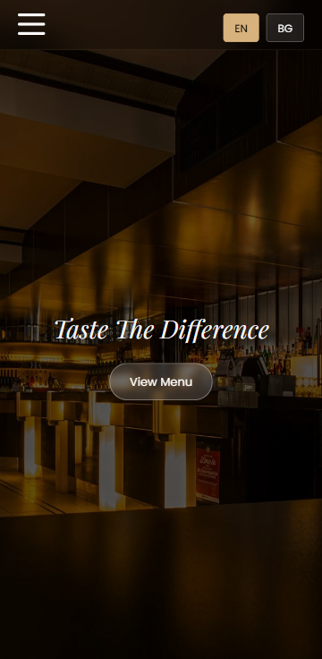
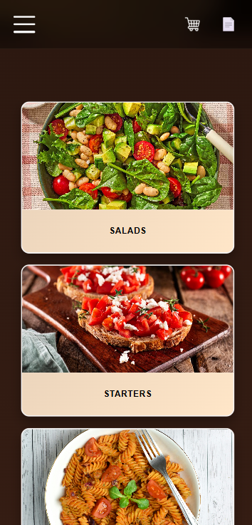
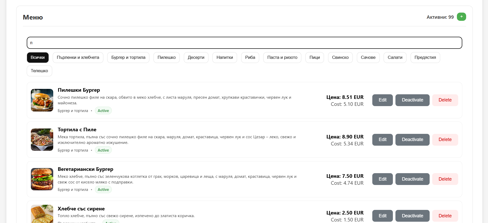
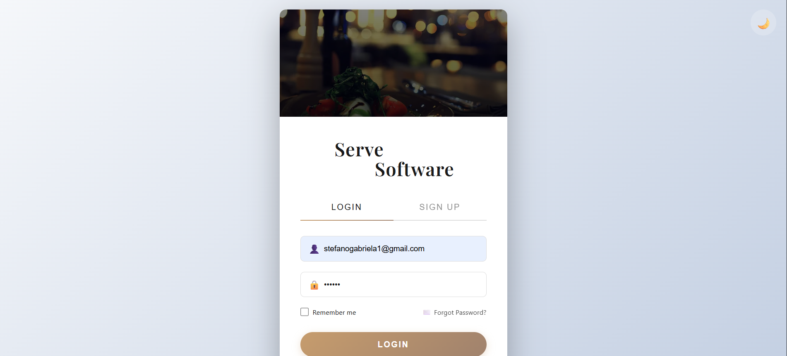
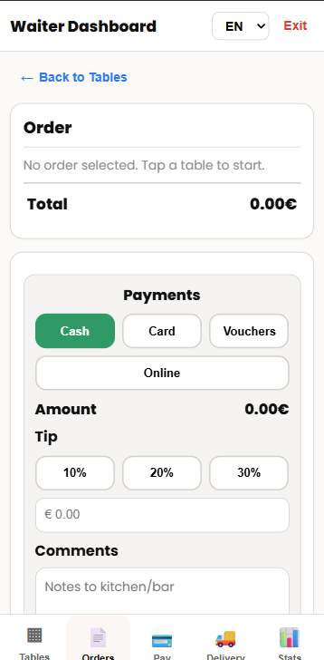
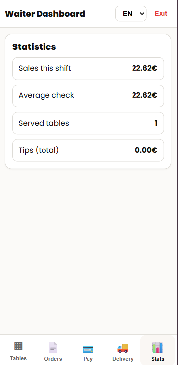
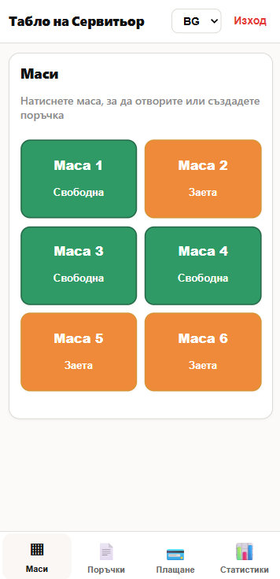

# ServeSoftware  
## Restaurant Management System (MVP)

ServeSoftware е уеб-базирана система за управление на ресторант, която обединява клиенти, сервитьори, кухня, бар и мениджмънт в единен реално-времеви работен процес.  
Проектът цели да улесни процеса на поръчване, проследяване и управление на маси и сметки.  
Системата е предназначена за малки и средни ресторанти, които търсят дигитализация на основните си процеси.

---

## MVP обхват (кратко описание)

| MUST HAVE (задължителни) | NICE TO HAVE (незадължителни) |
|--------------------------|-------------------------------|
| QR меню и създаване на поръчки | Базови AI анализи (натоварване, популярни артикули) |
| Управление на маси и сметки | История и архив на поръчките с филтриране и търсене
| Реално-времеви статуси за кухня | Интеграция с външни системи (касов апарат, складова система)
| Реално-времеви статуси за бар | Multi-ресторант поддръжка (управление на няколко обекта от един профил)
| Административен панел за меню и служители | Offline режим с последваща синхронизация
| Генериране на PDF сметки |

Подробното MVP описание се намира в `docs/MVP.md`.

---

## Използвани технологии

- HTML5  
- CSS3  
- JavaScript  
- Firebase (Database)

---

## Стартиране на проекта

### Изисквания
- Съвременен уеб браузър (Chrome, Edge, Firefox)
- Интернет връзка

### Стъпки за стартиране
1. Клониране или изтегляне на GitHub хранилището
2. Отваряне на файла `index.html` в браузър

### Забележки
- Проектът използва Firebase като външна услуга
- За демонстрация се използва вече конфигурирана Firebase база данни

---

## Структура на проекта

- /src – изходен код на приложението (в процес на разработка)
- /docs – проектна документация
- /assets – ресурси (изображения, икони и др.)

---

## Screenshots

### Основен екран

### Категория в менюто

### Влизане в акаунта на мениджъра

### Табло на мениджъра - Финанси

### Табло на мениджъра - Персонал

### Табло на мениджъра - Меню

### Влизане в акаунта на сервитьора

### Поръчки

### Статистики

### Управление на маси

---

## Допълнителна документация

- [Подробно MVP описание](docs/MVP.md)
- [Тестване на проекта](docs/TESTING.md)
- [Открити бъгове](docs/BUGS.md)
- [Принос и самооценка](docs/CONTRIBUTION.md)
